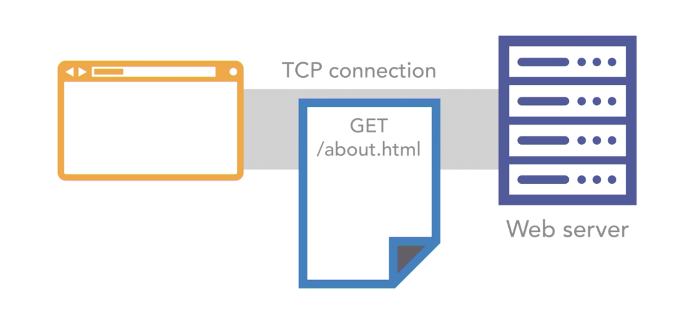
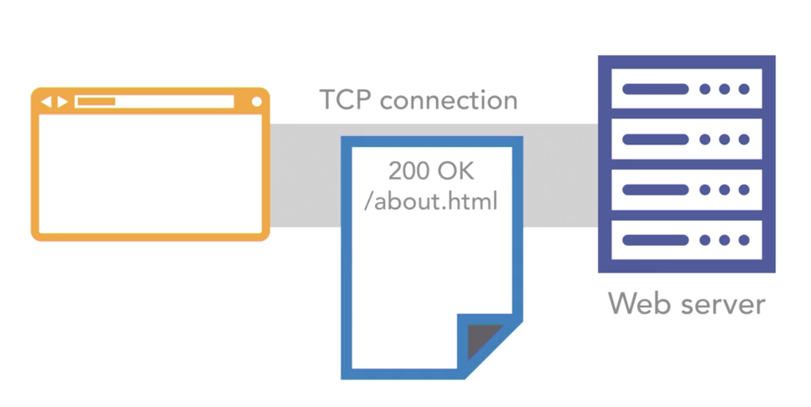

<h1 align="center" style="font-size: 150px">webserv</h1>

<p align="center">

</p>

<p align="center">
	<b><i>Project developed at <a href="https://www.1337.ma/">1337 Khouribga </a> coding school.</i></b><br>
    <b><i>Authors: <a href="https://github.com/fathjami">@JamiaFathiya</a> & <a href="https://twitter.com/suprivada">@achrafelkhnissi</a> & <a href="https://github.com/abellaismail7">@abellaismail7</a></i></b>
<!--
 <b><i>Grade: 125/100</i></b>
-->
</p>

<p align="center">
	
	
	
	
	
</p>

---

# HTTP

## What is HTTP?
HTTP stands for Hypertext Transfer Protocol, which is a protocol used to transfer hypertext. This raises two questions: what is a protocol, and what is hypertext? In this context, a protocol is a system of rules that enables the communication of information between different entities, such as computers. Hypertext is an outdated term for text displayed on a computer screen containing hyperlinks to other text, i.e., web documents. Therefore, the hypertext transfer protocol refers to the set of rules, servers, and browsers used to transfer web documents back and forth.

HTTP allows sessions, and stored states are shared between the browser and server. If a visitor is browsing a photo gallery, the browser and server can exchange information about the visitor's location in the sequence by passing information back and forth in the form of cookies. When the page is reloaded, the browser sends a cookie to the server indicating the last position visited, enabling the viewer to resume from that point. This means that while HTTP is stateless, it is not sessionless.

## Terminology

| Term | Definition |
| --- | --- |
| Browser | An application used to access and navigate between HTML documents. |
| User Agent | An application that acts on behalf of the user, typically a browser. |
| TCP | Short for Transmission Control Protocol, one of the main internet protocols used by the World Wide Web, email, FTP, and remote administration. |
| IP | Short for Internet Protocol. IP is used to transfer data between computers over a network. Every device connected to the internet has an IP address. |
| URL | Short for Uniform Resource Locator, an address pointing at a resource on the web. |
| DNS | Short for Domain Name Server. DNS catalogs all domain name URLs and points them to the IP addresses of servers. |
| Resource | The file or files available on a server when following a URL. |
| Server | A computer on the internet running some form of data storage and sharing application, most commonly a web server application. |
| Proxy | Software or hardware service acting as a middle person between clients and servers. |
| Request-Response Pairs | Clients and servers communicate over HTTP using request-response pairs. A request is sent, and a response is returned. |
| Header | Requests and responses use HTTP headers to pass information back and forth. |
| HTTP Request Method/Verb | Every HTTP request contains a method, also known as a verb, that explains what action the sender wants to perform on the resource (e.g., GET, PUT, DELETE). |
| Status Response Code | A numerical code in the 100 to 500 range describing what type of response the server sent back to the client. |
| Cache | A method for storing data on the client or the server to speed up performance. |
| Stateless | HTTP is stateless, meaning every request and response is unique, and no state is stored. |
| Cookie | A string of data passed back and forth between the client and server to create a stateful session. |
| Session | Clients and servers can share information about states by passing information back and forth, creating a session. |


## The HTTP Flow
1. First, the browser opens a TCP connection to the server. This ensures data can be sent back and forth over the network and that the data sent from one end is put together the same way at the other end. If the connection happens over HTTPS, TLS certificates are exchanged to ensure only the computer and the server can encrypt and decrypt the transmitted data. This prevents anyone from being able to eavesdrop on the conversation between the client and the server and steal the data they are transmitting.
2. Second, the browser sends an HTTP message. This message always contains an HTTP method, like GET, PUT, DELETE or something similar, and a URL pointing at the requested resource. It can also contain headers like cookies or authentication data and data if the browser is submitting data to the server using the post, put, or path methods.

<p align="center">

</p>

3. Third, the server performs the requested actions and sends a response back to the browser. This response will contain an HTTP status message indicating what happened, headers with information about the response, and whatever data was requested. This data could be an HTML document or a style sheet or a JavaScript file or image or any other type of content used in a standard website.

<p align="center">

</p>


4. Finally, once the response is fully received, the TCP connection is closed. Since HTTP is stateless, we are now back to a clean slate.


## HTTP Method table

| Method | Description | Success | Failure |
| --- | --- | --- | --- |
| GET | Get the specified resource, if available | 200 OK | 404 Not Found |
| POST | Create a new resource and add it to a collection | 201 Created | 401 Unauthorized, 409 Conflict, 404 Not Found |
| PUT | Update an existing singleton resource-based or id | 200 OK | 401 Unauthorized, 404 Not Found, 405 Method not Allowed |
| PATCH | Modify an existing singleton resource-based or ID | 200 OK | 401 Unauthorized, 404 Not Found, 405 Method not Allowed |
| DELETE | Delete singleton resource-based or ID (you can’t delete a collection of resources) | 200 OK | 401 Unauthorized, 404 Not Found |
| OPTION | Get the options available from this resource | 200 OK | - |
| HEAD | Get just the response headers from the resource | 200 OK | 404 Not Found |


# Functions

This section includes the description of the necessary functions to create a web server.


<details>

<summary><a href="">getaddrinfo()</a></summary>

```c++
int getaddrinfo(const char *node, const char *service, const struct addrinfo *hints, struct addrinfo **res);
```

- `node` : The hostname or IP address of the server.
  - If `node` is `NULL`, the IP address of the local host is used.
  - Can be a string representation of an IP address, or a hostname.
    - "hostname"
    - "127.0.0.1"
- `service` : The port number of the server.
  - If `service` is `NULL`, the default port number for the service requested in `hints` is used.
  - Can be a string representation of a port number, or a service name.
    - "80"
    - "http"
- `hints` : A pointer to a `struct addrinfo` that specifies criteria for selecting the socket address structures returned in the list pointed to by `res`.
  - If `hints` is `NULL`, then the returned list includes socket addresses for all socket types, for all protocol families supported by the address family of the specified node, and for the address of the local host.
  - The following fields of the `struct addrinfo` are used:
    - `ai_family` : The address family. The following constants are defined for the `ai_family` field:
      - `AF_INET` : IPv4 Internet protocols
      - `AF_INET6` : IPv6 Internet protocols
      - `AF_UNIX` : Local communication
      - `AF_UNSPEC` : Unspecified
    - `ai_socktype` : The socket type. The following constants are defined for the `ai_socktype` field:
      - `SOCK_STREAM` : Provides sequenced, reliable, two-way, connection-based byte streams. An out-of-band data transmission mechanism may be supported.
      - `SOCK_DGRAM` : Supports datagrams (connectionless, unreliable messages of a fixed maximum length).
      - `SOCK_RAW` : Provides raw network protocol access.
      - `SOCK_RDM` : Provides a reliable datagram layer that does not guarantee ordering.
      - `SOCK_SEQPACKET` : Provides a sequenced packet layer that does not guarantee ordering.
    - `ai_protocol` : The protocol for the socket. The following constants are defined for the `ai_protocol` field:
      - `IPPROTO_TCP` : Transmission Control Protocol
      - `IPPROTO_UDP` : User Datagram Protocol
      - `IPPROTO_RAW` : Raw protocol interface
      - `IPPROTO_IP` : Internet Protocol
      - `IPPROTO_ICMP` : Internet Control Message Protocol
      - `IPPROTO_IGMP` : Internet Group Management Protocol
      - `IPPROTO_IPV4` : Internet Protocol version 4
      - `IPPROTO_IPV6` : Internet Protocol version 6
- `res` : A pointer to a linked list of one or more `struct addrinfo` structures that contains response information about the host.
- Return value : On success, zero is returned. On error, -1 is returned, and `errno` is set appropriately.

- `struct addrinfo` :

```c++
struct addrinfo {
	int ai_flags;               // input flags        
	int ai_family;              // socket protocol family        
	int ai_socktype;            // socket type        
	int ai_protocol;            // protocol for socket        
	socklen_t   ai_addrlen;     // socket address length        
	struct sockaddr *ai_addr;   // socket address        
	char*   ai_canonname;       // service name        
	struct addrinfo *ai_next;   // next item in the list    
}; 
```

</details>

---

<details>

<summary><a href="">socket()</a></summary>

```c++
int socket(int domain, int type, int protocol);
```

- `domain` : The communication domain, which specifies the communication semantics and the protocol family to be used. The following constants are defined for the `domain` argument:
    - `AF_INET` : IPv4 Internet protocols
    - `AF_INET6` : IPv6 Internet protocols
    - `AF_UNIX` : Local communication
    - `AF_UNSPEC` : Unspecified
- `type` : The communication semantics. The following constants are defined for the `type` argument:
    - `SOCK_STREAM` : Provides sequenced, reliable, two-way, connection-based byte streams. An out-of-band data transmission mechanism may be supported.
    - `SOCK_DGRAM` : Supports datagrams (connectionless, unreliable messages of a fixed maximum length).
    - `SOCK_RAW` : Provides raw network protocol access.
    - `SOCK_RDM` : Provides a reliable datagram layer that does not guarantee ordering.
    - `SOCK_SEQPACKET` : Provides a sequenced packet layer that does not guarantee ordering.
- `protocol` : The protocol to be used with the socket. Normally only a single protocol exists to support a particular socket type within a given protocol family, in which case `protocol` can be specified as 0. The following constants are defined for the `protocol` argument:
    - `IPPROTO_TCP` : Transmission Control Protocol
    - `IPPROTO_UDP` : User Datagram Protocol
    - `IPPROTO_SCTP` : Stream Control Transmission Protocol
    - `IPPROTO_TIPC` : Transparent Inter-Process Communication
    - `IPPROTO_RAW` : Raw IP packets
    - '0' : Use default protocol
- Return value : On success, a file descriptor for the new socket is returned. On error, -1 is returned, and `errno` is set appropriately.

</details>

---

<details>


<summary><a href="">bind()</a></summary>

```c++
int bind(int sockfd, const struct sockaddr *addr, socklen_t addrlen);
```

- `sockfd` : The file descriptor of the socket to be bound.
- `addr` : A pointer to a `sockaddr` structure containing the address to be bound to the socket. The length and format of the address depend on the address family of the socket.
- `addrlen` : The size, in bytes, of the address structure pointed to by the `addr` argument.
- Return value : On success, zero is returned. On error, -1 is returned, and `errno` is set appropriately.

</details>

---

<details>

<summary><a href="">listen()</a></summary>

```c++
int listen(int sockfd, int backlog);
```

- `sockfd` : The file descriptor of the socket to be listened.
- `backlog` : The maximum length to which the queue of pending connections for `sockfd` may grow.
- Return value : On success, zero is returned. On error, -1 is returned, and `errno` is set appropriately.

</details>

---

<details>

<summary><a href="">accept()</a></summary>

```c++
int accept(int sockfd, struct sockaddr *addr, socklen_t *addrlen);
```

- `sockfd` : The file descriptor of the socket to be accepted.
- `addr` : A pointer to a `sockaddr` structure. This structure is filled in with the address of the peer socket, as known to the communications layer. The exact format of the address returned addr is determined by the socket's address family. When the returned address is too long to fit in the supplied `sockaddr` structure, the address is truncated.
- `addrlen` : A pointer to a `socklen_t` object which on input specifies the length of the supplied `sockaddr` structure, and on output specifies the length of the stored address.
- Return value : On success, these system calls return a non-negative integer that is a descriptor for the accepted socket. On error, -1 is returned, and `errno` is set appropriately.

</details>

---

<details>

<summary><a href="">recv()</a></summary>

```c++
ssize_t recv(int sockfd, void *buf, size_t len, int flags);
```

- `sockfd` : The file descriptor of the socket to be received.
- `buf` : A pointer to a buffer where the message should be stored.
- `len` : The length in bytes of the buffer pointed to by the `buf` argument.
- `flags` : Specifies the type of message reception. The value is formed by logically OR'ing zero or more of the following values:
    - `MSG_OOB` : Process out-of-band data.
    - `MSG_PEEK` : Peek at incoming messages.
    - `MSG_WAITALL` : Wait for a full request, unless the socket is nonblocking.
    - `MSG_DONTWAIT` : Enables nonblocking operation; if the operation would block, the call fails with the error `EAGAIN` or `EWOULDBLOCK`.
    - `MSG_NOSIGNAL` : Do not generate `SIGPIPE` when writing to a pipe with no one to read it.
    - '0' : Use default flag
- Return value : On success, these calls return the number of bytes received. If no messages are available to be received and the peer has performed an orderly shutdown, `recv()` returns 0. On error, -1 is returned, and `errno` is set appropriately.


</details>

---

<details>

<summary><a href="">send()</a></summary>

```c++
ssize_t send(int sockfd, const void *buf, size_t len, int flags);
```

- `sockfd` : The file descriptor of the socket to be sent.
- `buf` : A pointer to a buffer containing the message to be sent.
- `len` : The length in bytes of the message pointed to by the `buf` argument.
- 'flags' : Specifies the type of message transmission. The value is formed by logically OR'ing zero or more of the following values:
    - `MSG_OOB` : Process out-of-band data.
    - `MSG_DONTROUTE` : Bypass routing, use direct interface.
    - `MSG_DONTWAIT` : Enables nonblocking operation; if the operation would block, the call fails with the error `EAGAIN` or `EWOULDBLOCK`.
    - `MSG_NOSIGNAL` : Do not generate `SIGPIPE` when writing to a pipe with no one to read it.
    - '0' : Use default flag
- Return value : On success, these calls return the number of bytes sent. On error, -1 is returned, and `errno` is set appropriately.

</details>

---


## Resources

- **General**
  - [Beej's Guide to Network Programming](https://beej.us/guide/bgnet/html/)
  - [HTTP Server: Everything You Need to Know](https://medium.com/from-the-scratch/http-server-what-do-you-need-to-know-to-build-a-simple-http-server-from-scratch-d1ef8945e4fa)
  - [SOCKETS - SERVER & CLIENT](https://bogotobogo.com/cplusplus/sockets_server_client.php)
  - [Socket Programming in C](https://www.geeksforgeeks.org/socket-programming-cc/)
  - [Unix Socket - Server Examples](https://www.tutorialspoint.com/unix_sockets/socket_server_example.htm)
  - [How to set a socket to non-blocking mode in C](https://jameshfisher.com/2017/04/05/set_socket_nonblocking/)
  - [Nginx Server and Location Block Selection Algorithm](https://www.cloudsigma.com/nginx-server-and-location-block-selection-algorithms-overview/)
  - [Understanding Nginx Server and Location Block Selection Algorithms](https://www.digitalocean.com/community/tutorials/understanding-nginx-server-and-location-block-selection-algorithms)
  - [Understanding the Nginx Configuration File Structure and Configuration Contexts](https://www.digitalocean.com/community/tutorials/understanding-the-nginx-configuration-file-structure-and-configuration-contexts)
  - [An overview of HTTP](https://developer.mozilla.org/en-US/docs/Web/HTTP/Overview)
  - [Using HTTP cookies](https://developer.mozilla.org/en-US/docs/Web/HTTP/Cookies)
  - [How the web works: HTTP and CGI explained](https://www.garshol.priv.no/download/text/http-tut.html)

- **HTTP Request**
  - [HTTP Message](https://developer.mozilla.org/en-US/docs/Web/HTTP/Messages)
  - [HTTP Request Methods](https://developer.mozilla.org/en-US/docs/Web/HTTP/Methods)
  - [HTTP Request Parser in C](https://codereview.stackexchange.com/questions/188384/http-request-parser-in-c)
  - [HTTP Requests](https://www.codecademy.com/article/http-requests)

- **HTTP Response**
  - [The HTTP Response Headers List](https://flaviocopes.com/http-response-headers/)
  - [HTTP Response Status Codes](https://developer.mozilla.org/en-US/docs/Web/HTTP/Status)

- **CGI**
  - [Getting Started with CGI Programming in C](https://jkorpela.fi/forms/cgic.html)
  - [Query String](https://en.wikipedia.org/wiki/Query_string)
  - [CGI Programming](https://www.ibm.com/docs/en/i/7.4?topic=programming-cgi)
  - [Common Gateway Interface](https://en.wikipedia.org/wiki/Common_Gateway_Interface)
  - [Getting Started with CGI Programming](https://www.mnuwer.dbasedeveloper.co.uk/dlearn/web/session01.htm)
  - [HOW-TO Write a CGI Program in C/C++](https://www.purplepixie.org/cgi/howto.php)
  - [CGI Programming 101](http://www.cgi101.com/book/ch1/text.html)
  - [Environment Variables set by HTTP server](https://www.ibm.com/docs/en/i/7.4?topic=information-environment-variables)
  - [Developing CGIs with C and C++](https://cmd.inp.nsk.su/old/cmd2/manuals/unix/UNIX_Unleashed/ch20.htm)
  
- **Stress testing**
  - [Load Testing Web Servers with Siege](https://www.linode.com/docs/guides/load-testing-with-siege/)
